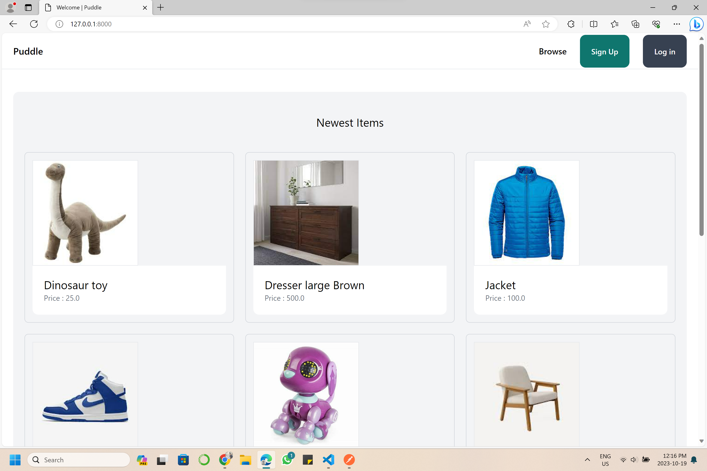
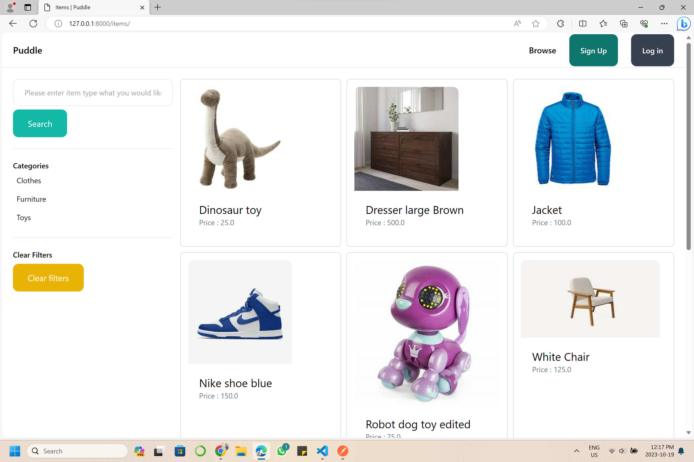
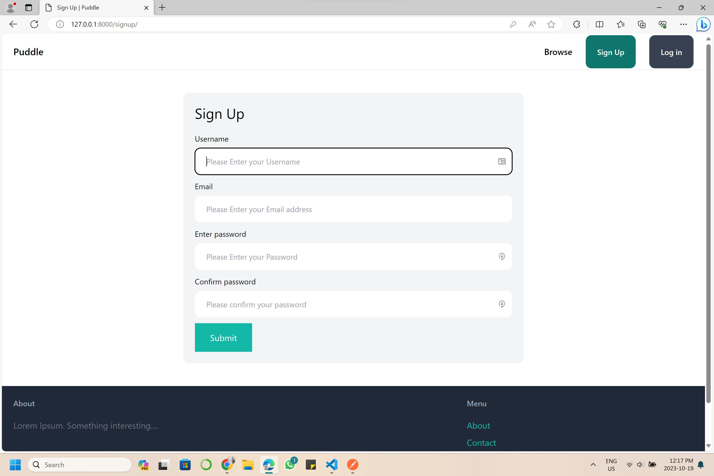
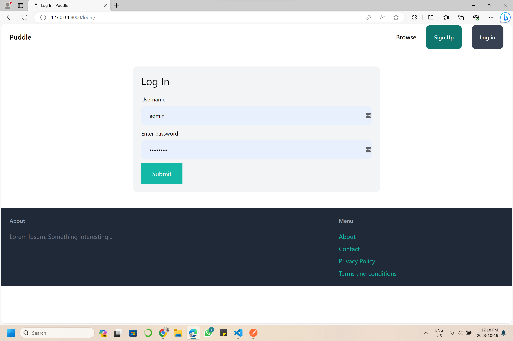
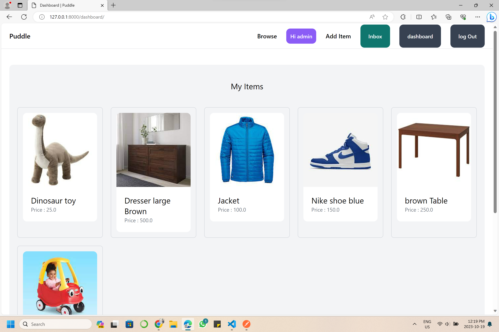
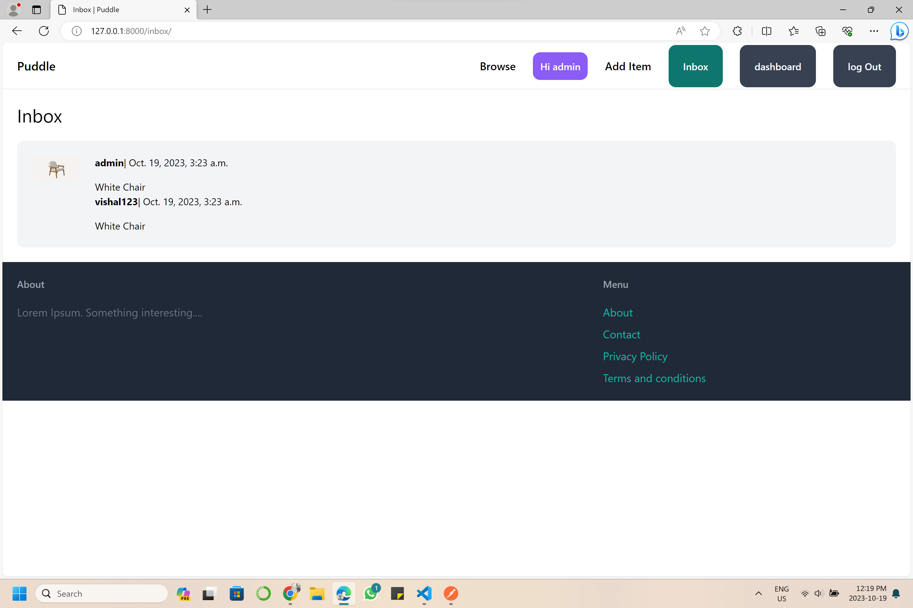
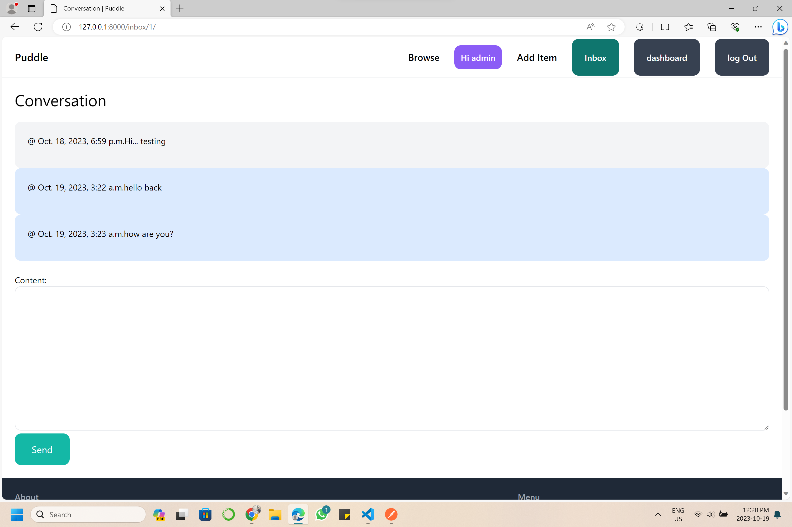

ECHO is on.

`PUDDLE` is a simple online market place application using django.

Have functions for posting ads,with picture and description, price etc..
items can be browsed and filtered. can contact seller by message.

# Home page

# Browse Items

# Sign up page:

# Login page:

# Dashboard View:

# Inbox and messages:

# Add item screen

