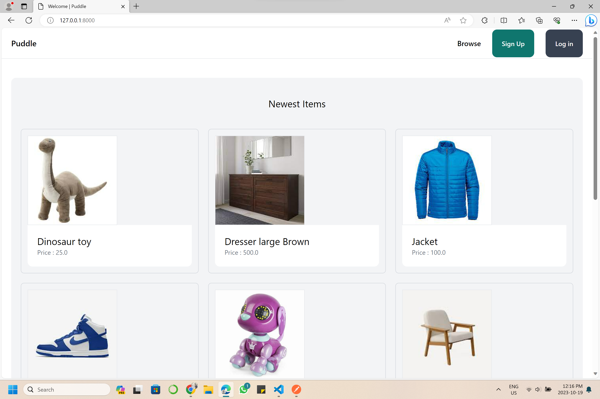
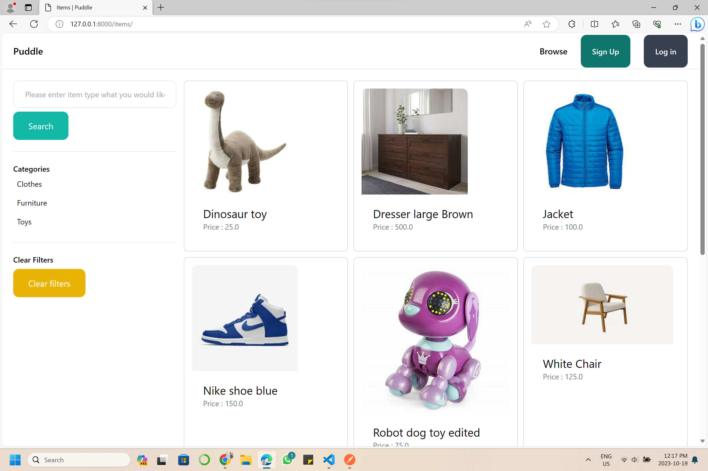
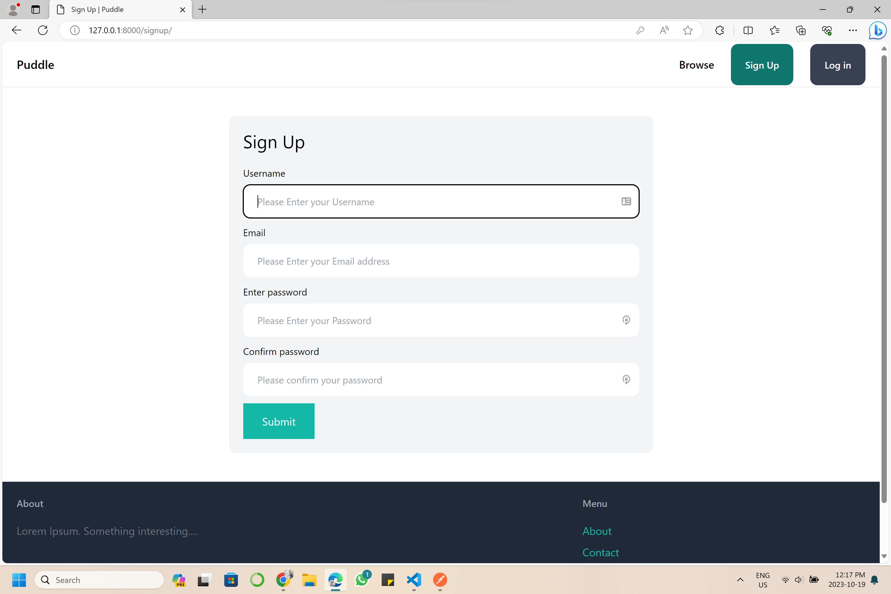
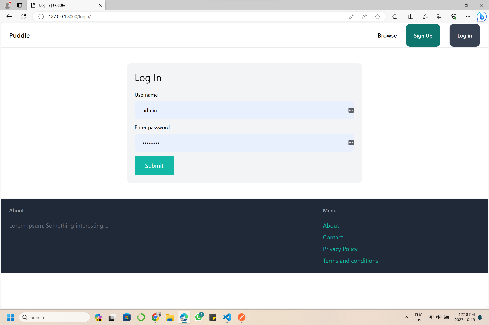
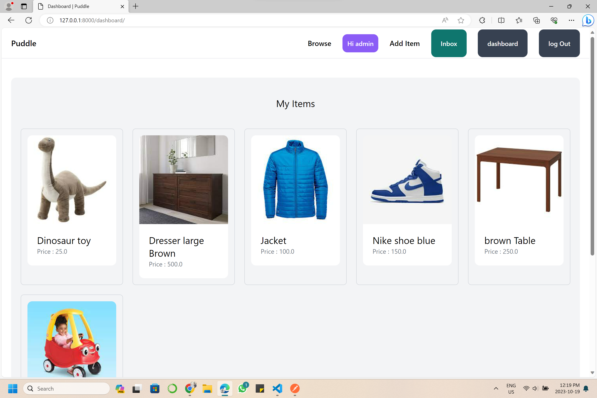
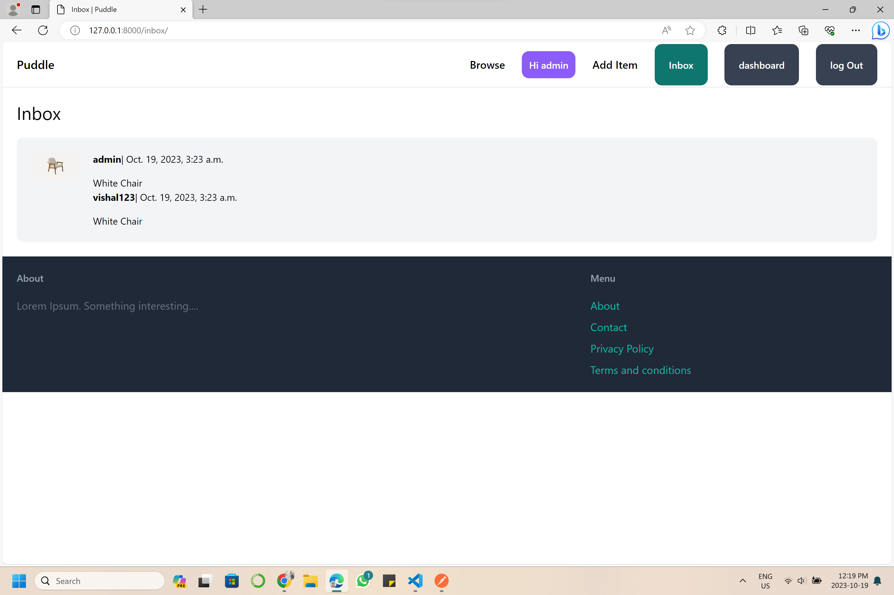
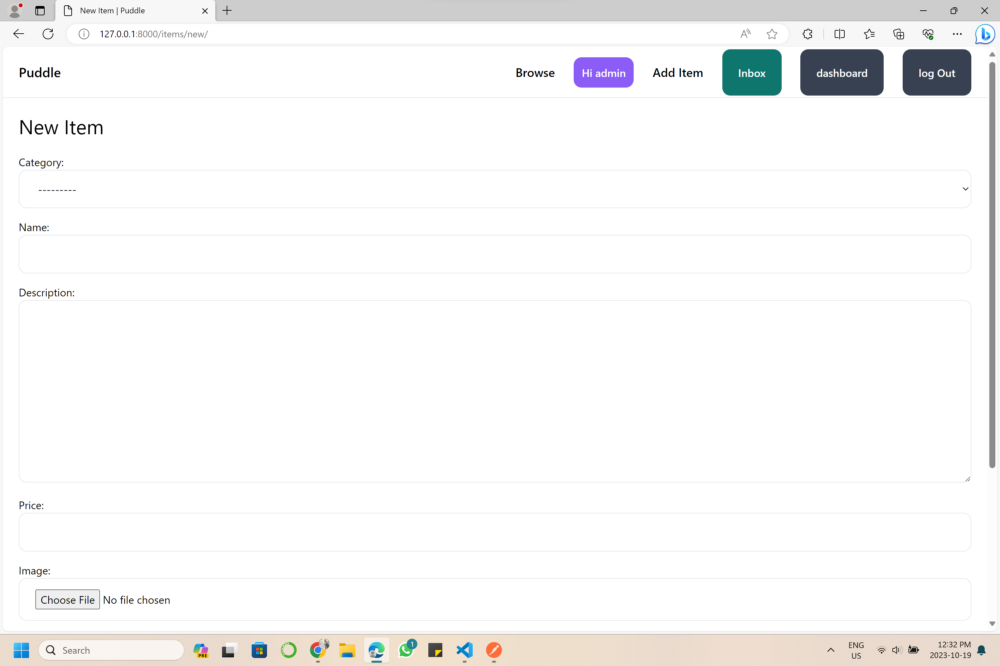

ECHO is on.

`PUDDLE` is a simple online market place application using django.

Have functions for posting ads,with picture and description, price etc..
items can be browsed and filtered. can contact seller by message.

# LINK TO DEMO

1. for browsing and filtering:
   <a href='demo/Browsing and filtering.mp4'>Browsing and filtering</a>
2. Signup and login:
   <a href='demo/Signup and login.mp4'>Signup and login</a>
3. Item adding and contacting seller:
   <a href='demo/item adding and contacting seller.mp4'>item adding and contacting seller</a>

# Home page

# Browse Items

# Sign up page:

# Login page:

# Dashboard View:

# Inbox and messages:

# Add item screen

